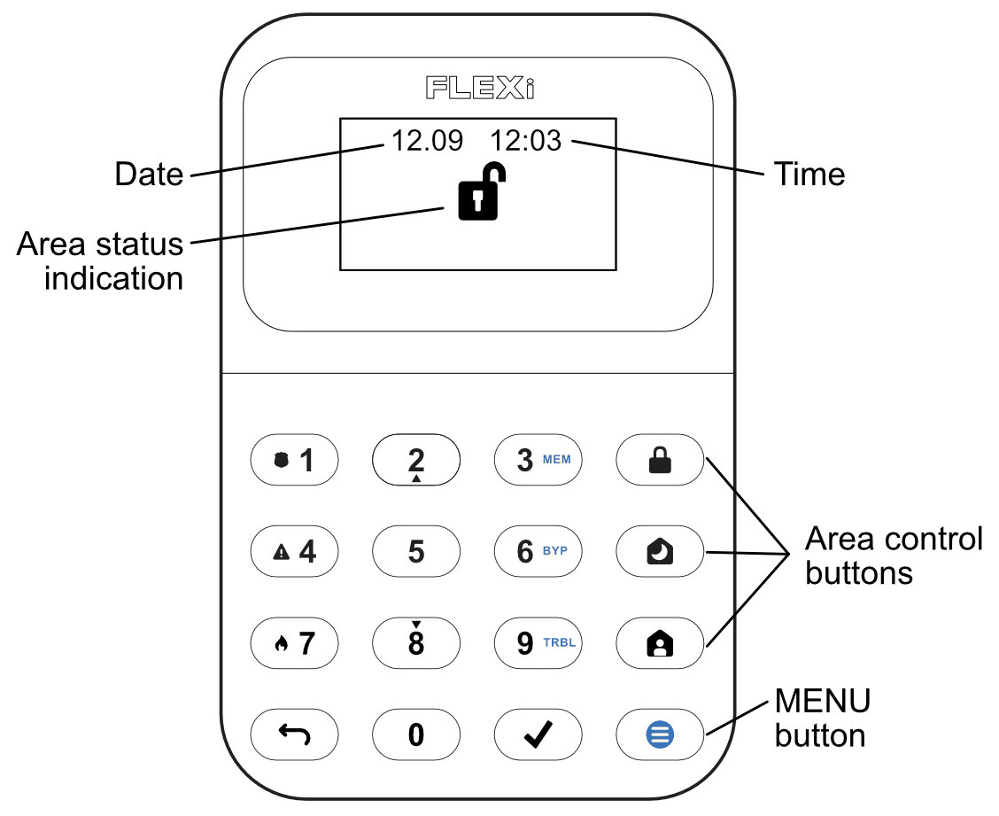
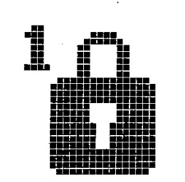
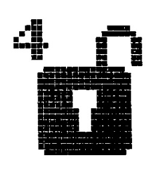
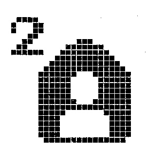
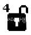
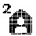

# **FLEXi** / **Keypad SK-LCD button – Brief User Guide**

## Keypad overview

  

## Alarm system arming / disarming

## <u>Alarm system ARM:</u>

1.  Make sure all zones are not violated.

2.  Press the [] button.

3.  Enter User code.

4.  Select the button of area to be activated.

5.  Press [] button.

6.  Exit the premises within time delayed.

When the system is armed, the  icon will light up.

## <u>SLEEP mode activation:</u>

(Premises perimeter is secured. Movement inside is allowed. If you open the entrance door, the alarm will actuate immediately):

1.  Press [] button.

2.  Enter User code.

3.  Press the button of area to be activated.

4.  Press [] button.

5.  SLEEP mode will turn on immediately, without exit delay.

The  icon will illuminate when SLEEP mode is on.

## <u>Alarm system DISARM</u>:

1.  Enter User code.

2.  Press the button of particular area you wish to disarm.

3.  Press [] button.

When the alarm is disarmed the  icon must be illuminated.

## <u>STAY mode activation</u>:

(Premises perimeter is secured. Movement inside is allowed. Any opening of entrance door enables time delay during which you have to disarm the alarm):

1.  Press [] button.

2.  Enter User code.

3.  Press the button of area to be activated.

4.  Press [] button.

5.  STAY mode will turn on immediately, without exit delay.

The  icon will illuminate when STAY mode is on.

For area status changing into the opposite one it is sufficient to enter User code and select the preferred area. To delete symbols or command entered, press button [].

## Emergency buttons

#### Fire (smoke) detector reset

**<u>To send emergency message to your security service:</u>**

- **Police** – hold [**1**] button pressed for 3 sec.

- **Medical Aid** – hold [**4**] button pressed for 3 sec.

- **Fire Service** – hold [**7**] button pressed for 3 sec.

**<u>To reset fire (smoke) detectors:</u>**

- Hold button [] pressed for 3 seconds.

**<u>Note.</u>** Fire (smoke) detectors do not reset automatically after fire emergency detection. They can be reset only manually.

## Illumination brightness and indication sound adjustment

#### Temporary zone monitoring deactivation (BYPASS function)

## <u>Brightness of the keypad buttons</u>

1.  Select the preferred brightness of the keypad button backlight using the [**2**] and [**8**] buttons.

**<u>The brightness of the LCD display</u>**

1.  Select the preferred illumination brightness of zone indication using [**2**] and [**8**] buttons.

**<u>Keypad keystroke volume</u>**

1.  Select the preferred sound indication level using [**2**] and [**8**] buttons.

**<u>Note:</u>** Turn off keypad lighting in standby mode. Pressing [] and then press [**5**] [**4**]. Switch the keypad indicator backlight status in standby mode by pressing [**1**] (backlight on) or [**2**] (backlight off). Press [] to save the new value.

**<u>BYPASS function activation:</u>**

2. Enter the alarm control code.

**<u>BYPASS function deactivation:</u>**

Repeat the same actions as in deactivation of particular zone monitoring.

## Entering or changing / User or Master codes

#### Deleting User codes

**<u>To enter a new or change the existing User code:</u>**

1.  Enter **Master** code, default code – 1234.

**<u>Note.</u>** Sequence number of **Master** code - [**01**].

**<u>To delete User code:</u>**

1.  Press the sequence numbers of areas which should be controlled by User.
1.  Enter **Master** code.

The keypad “SK-LCD button” for alarm system control displays the states of **64 zones and 8 partitions**. Also, the “SK-LCD button” keypad can be assigned to control one or more desired areas (control panel firmware version from FW: SP3_xxx4_0121). The keypad will display the statuses of the assigned area and area zones.

## Graphic symbols

| Symbol | Description | Symbol | Description |
|----|----|----|----|
|  | Control panel not connected |  | Fire loop trouble |
|  | Partition 1 Armed |  | Network trouble list |
|  | Partition 4 Disarmed |  | CMS 1 (2) trouble |
|  | Partition 2 Stay |  | Cloud trouble |
|  | Partition 3 Sleep |  | SIM card trouble |
|  | MENU button |  | SIM card password trouble |
|  | ENTER function button |  | SIM card network trouble |
|  | Partition |  | WiFi trouble |
|  | Alarm |  | RS485 interface trouble |
|  | Fire |  | SIM card 2 trouble |
|  | User code |  | LAN trouble |
|  | User |  | Wireless low battery |
|  | Entry/Exit |  | Power trouble |
|  | Zone open |  | Bell trouble |
|  | Bypass |  | Tamper trouble |
|  | Memory |  | Antimasking trouble |
|  | Trouble |  | Wireless trouble |
|  | System trouble list |  | Expander module trouble |
|  | AC power trouble |  | Settings |
|  | Battery trouble |  | Volume |
|  | AUX overcurrent |  | LCD brightness |
|  | Time not set |  | Keypad brightness |
|  | Bell overcurrent |  | Standby light O-On / I-Off |
|  | Bell missing |  | Info |
